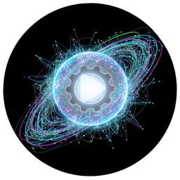

<div align="center">
  
  <h1>Universal SR Studio</h1>
  <p>Graphical interface for training super-resolution AI models<br>with <strong>NeoSR</strong> and <strong>traiNNer-Redux</strong> engines.</p>

  <a href="https://github.com/Crysisjim/Universal-SR-Studio/releases"></a>
  <a href="https://github.com/Crysisjim/Universal-SR-Studio/wiki"></a>
  
  
  

  <br/><br/>

   🇬🇧 [English](#english) | 🇫🇷 [Français](#français)
</div>

---

<a name="english"></a>
## 🇬🇧 English

A graphical interface for training and managing super-resolution AI models with **NeoSR** and **traiNNer-Redux** engines.

[](https://github.com/Crysisjim/Universal-SR-Studio/wiki)

### Features

- **Configuration wizard** — visual TOML/YAML config editor for NeoSR and traiNNer-Redux
- **Training monitor** — real-time loss curves, PSNR/SSIM, TensorBoard integration, live GPU stats
- **OTF preview** — on-the-fly degradation pipeline preview (blur, noise, JPEG, compression, screentone, dithering, …)
- **Benchmark suite** — automated architecture and feature benchmarks with resume support
- **Model tools** — quick upscale, model export (safetensors), model packaging
- **Dataset tools** — tile splitter, validation rotation, LMDB converter
- **Distributed training** — multi-machine training coordination
- **Training queue** — schedule multiple training sessions back-to-back
- **20+ themes** — customizable UI themes
- **Bilingual UI** — French / English interface

### Quick Start — Portable (recommended)

1. Download `Universal_SR_Studio_v2.4.0_portable.zip` from [Releases](https://github.com/Crysisjim/Universal-SR-Studio/releases)
2. Extract anywhere
3. Run `Universal_SR_Studio.exe`
4. On first launch, choose your language (FR/EN), then go to **⚙️ Settings** → the built-in installer handles everything else

> No Python installation required. The portable version is fully self-contained.

### Prerequisites

- **Windows 10/11**
- **NVIDIA GPU** with CUDA support (8 GB+ VRAM recommended)
- **Internet connection** for the first setup (engine download)

That's it. Universal SR Studio handles the rest automatically via the **⚙️ Settings** tab.

### Automatic Setup (via Settings tab)

| Step | What it does |
|------|-------------|
| **GPU detection** | Detects your GPU and recommends the correct PyTorch + CUDA version |
| **Engine install** | Downloads and installs NeoSR and/or traiNNer-Redux from their official repositories |
| **Virtual environment** | Creates an isolated `.venv` for each engine |
| **PyTorch** | Installs the correct CUDA-compatible version automatically |
| **Dependencies** | Installs all engine-specific packages |

Just open the **⚙️ Settings** tab, choose which engine(s) to install, and click — the console window shows live progress.

### Expected folder structure

```
~/IA_Engine/
├── traiNNer-redux/        (installed via Settings)
│   └── .venv/
├── neosr/                 (installed via Settings)
│   └── .venv/
├── datasets/
│   ├── train/HR/          (your training images)
│   └── val/
│       ├── GT/
│       └── LQ/
└── Option Custom/         (custom degradation presets)
```

### Source installation (developers)

```bash
git clone https://github.com/Crysisjim/Universal-SR-Studio.git
cd Universal-SR-Studio
pip install -r requirements.txt
python main.py
```

Then use the **⚙️ Settings** tab to install the training engines.

### Tabs overview

| Tab | Description |
|-----|-------------|
| 😊 Assistant | Guided setup wizard for beginners |
| 📝 Configuration | TOML/YAML config editor with live OTF preview |
| 🚀 Training | Start/stop training, live curves, TensorBoard |
| 🔧 Tools | Benchmark, quick upscale, model export, dataset tools |
| 📋 Queue | Schedule multiple training sessions |
| ⚙️ Settings | Engine installer, paths, language, appearance, API keys |
| 🌐 Distributed | Multi-machine training (experimental) |
| 📖 Wiki | Opens the GitHub wiki documentation in your browser |

### Benchmarks (CLI)

```bash
# Architecture benchmark (traiNNer-Redux)
python src/core/benchmark_runner.py --engine redux --type arch

# Feature benchmark (NeoSR)
python src/core/benchmark_runner.py --engine neosr --type feature

# List available tests
python src/core/benchmark_runner.py --list
```

### Contributing

Pull requests welcome. For major changes, open an issue first.

1. Fork the repository
2. Create a feature branch (`git checkout -b feature/my-feature`)
3. Commit your changes
4. Open a pull request

### License

[MIT](LICENSE) — free to use, modify, and distribute.

---

<a name="français"></a>
## 🇫🇷 Français

Interface graphique pour l'entraînement et la gestion de modèles d'IA super-résolution avec les moteurs **NeoSR** et **traiNNer-Redux**.

[](https://github.com/Crysisjim/Universal-SR-Studio/wiki)

### Fonctionnalités

- **Assistant de configuration** — éditeur visuel TOML/YAML pour NeoSR et traiNNer-Redux
- **Moniteur d'entraînement** — courbes de perte en temps réel, PSNR/SSIM, intégration TensorBoard, stats GPU live
- **Aperçu OTF** — prévisualisation du pipeline de dégradation à la volée (flou, bruit, JPEG, compression, screentone, dithering, …)
- **Suite de benchmarks** — benchmarks automatisés d'architectures et de features avec reprise
- **Outils modèles** — upscale rapide, export modèle (safetensors), packaging
- **Outils dataset** — découpeur de tuiles, rotation de validation, convertisseur LMDB
- **Entraînement distribué** — coordination multi-machines
- **File d'entraînements** — planifier plusieurs sessions à la suite
- **20+ thèmes** — thèmes UI personnalisables
- **Interface bilingue** — Français / Anglais

### Démarrage rapide — Portable (recommandé)

1. Télécharger `Universal_SR_Studio_v2.4.0_portable.zip` depuis les [Releases](https://github.com/Crysisjim/Universal-SR-Studio/releases)
2. Extraire n'importe où
3. Lancer `Universal_SR_Studio.exe`
4. Au premier lancement, choisir la langue (FR/EN), puis aller dans **⚙️ Paramètres** → l'installeur intégré gère le reste

> Aucune installation Python requise. La version portable est entièrement autonome.

### Prérequis

- **Windows 10/11**
- **GPU NVIDIA** avec support CUDA (8 Go+ VRAM recommandé)
- **Connexion internet** pour le premier setup (téléchargement des moteurs)

C'est tout. Universal SR Studio gère le reste automatiquement via l'onglet **⚙️ Paramètres**.

### Installation automatique (via l'onglet Paramètres)

| Étape | Action |
|-------|--------|
| **Détection GPU** | Détecte le GPU et recommande la bonne version PyTorch + CUDA |
| **Installation moteur** | Télécharge et installe NeoSR et/ou traiNNer-Redux depuis leurs dépôts officiels |
| **Environnement virtuel** | Crée un `.venv` isolé pour chaque moteur |
| **PyTorch** | Installe la version compatible CUDA automatiquement |
| **Dépendances** | Installe tous les packages spécifiques au moteur |

Ouvrir l'onglet **⚙️ Paramètres**, choisir le(s) moteur(s) à installer, et cliquer — la console affiche la progression en direct.

### Structure de dossiers attendue

```
~/IA_Engine/
├── traiNNer-redux/        (installé via Paramètres)
│   └── .venv/
├── neosr/                 (installé via Paramètres)
│   └── .venv/
├── datasets/
│   ├── train/HR/          (vos images d'entraînement)
│   └── val/
│       ├── GT/
│       └── LQ/
└── Option Custom/         (presets de dégradation personnalisés)
```

### Installation source (développeurs)

```bash
git clone https://github.com/Crysisjim/Universal-SR-Studio.git
cd Universal-SR-Studio
pip install -r requirements.txt
python main.py
```

Puis utiliser l'onglet **⚙️ Paramètres** pour installer les moteurs d'entraînement.

### Aperçu des onglets

| Onglet | Description |
|--------|-------------|
| 😊 Assistant | Wizard de configuration guidée pour débutants |
| 📝 Configuration | Éditeur TOML/YAML avec prévisualisation OTF live |
| 🚀 Entraînement | Démarrer/arrêter, courbes live, TensorBoard |
| 🔧 Outils | Benchmark, upscale rapide, export modèle, outils dataset |
| 📋 File d'attente | Planifier plusieurs sessions d'entraînement |
| ⚙️ Paramètres | Installeur moteurs, chemins, langue, apparence, clés API |
| 🌐 Distribué | Entraînement multi-machines (expérimental) |
| 📖 Wiki | Ouvre la documentation wiki GitHub dans le navigateur |

### Contribuer

Les pull requests sont les bienvenues. Pour les changements majeurs, ouvrir une issue d'abord.

1. Forker le dépôt
2. Créer une branche (`git checkout -b feature/ma-feature`)
3. Commiter les changements
4. Ouvrir une pull request

### Licence

[MIT](LICENSE) — libre d'utilisation, de modification et de distribution.
