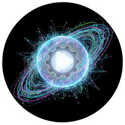

<div align="center">
  
  <h1>Universal SR Studio</h1>
  <p>Graphical interface for training super-resolution AI models<br>with <strong>NeoSR</strong> and <strong>traiNNer-Redux</strong> engines.</p>

  <a href="https://github.com/Crysisjim/Universal-SR-Studio/releases"></a>
  <a href="https://github.com/Crysisjim/Universal-SR-Studio/wiki"></a>
  
  
  

  <br/><br/>

   🇬🇧 [English](#english) | 🇫🇷 [Français](#français)
</div>

---

<a name="english"></a>
## 🇬🇧 English

A graphical interface for training and managing super-resolution AI models with **NeoSR** and **traiNNer-Redux** engines.

[](https://github.com/Crysisjim/Universal-SR-Studio/wiki)

### What's new in v2.5.7

- **New "⚗ Post Processing" tab** — post-process an image or a folder *after* upscaling, independently of the upscale step. Ordered chain: **Temporal Fix → Undistort → Color correction → Resize → Sharpen (UnsharpMask)**. Each stage has an enable toggle and a ⚙ settings popup, with a Before/After preview, a live log and a progress bar.
- **Temporal Fix** — reduces temporal flicker between frames. Modes: *Classic* (motion-aware blend, no weights) or neural models *S1 / S2 / S3* (pifroggi) with on-demand weight download. Backends: PyTorch CUDA, OnnxRuntime (CUDA), TensorRT + OnnxRuntime, CPU.
- **Undistort** — removes temporal high-frequency artifacts (shimmering / jittering edges on SR output). Modes: *Classic* (temporal HF median, no weights) or neural *TMT* (xg416), with the same backend choices and on-demand weights.
- **AI assistant button in Post Processing** — get recommended settings for the post-processing chain.
- **SparkLoss `Clamp (max_score)` field** — now exposed in the Configuration losses block; the losses block was widened and aerated (full labels, no abbreviations) for the GAN Phase 2 workflow.
- **Important fixes:**
  - **Mixed-resolution batches** — a folder mixing e.g. 1080p and 480p frames no longer crashes (`cannot reshape array of size …`) and no longer triggers a VRAM explosion + permanent slowdown (cuDNN autotune storm now disabled for inference; allocator defragmented on resolution change).
  - **Pascal GPUs (GTX 1080 / 1080 Ti, sm_61)** — Temporal Fix / Undistort now run inside the engine venv subprocess → fixes `no kernel image for device`.
  - **ONNX Temporal Fix** — fixed rank error (5D vs 4D input) on the OnnxRuntime backend.
  - **ORT performance** — the inference session is now cached once (no reload between frames).
  - GPU stats reliability (pynvml), zombie process on close, double-launch guard.

### What's new in v2.5.6

- **Shared venv** — single `runtimes/.venv` replaces dual neosr+traiNNer venvs; Python 3.12.9, numpy ≥2, traiNNer-redux `dev` branch; saves ~3 GB disk
- **New architectures** — custom-bundled and auto-injected: **ParagonSR** (nano/tiny/xs/s/m/l/xl/anime), **ParagonSR2** (photo/pro/realtime/stream/ultimate/ultimate_v2), **AetherNet** (NeoSR, mobile→extreme), FIGSR, GFISRv2, SMoSR, SPANpp; native in traiNNer-redux dev: srformer/v2, fdat, tfdat, spanf, spanplus, moesr/mosr/mosrv2, temporal_span_v2
- **GAN Phase 2 training** — `RealESRGANModel` + `UNetDiscriminatorSN` pipeline; Adaptive D checkbox (auto-pauses discriminator to prevent collapse); SparkLoss FD + PerceptualAnimeLoss in Redux config; GAN weight persistence fix
- **Custom degradations** — Custom 3+4 groups now correctly applied to training (were wired in UI but missing from sidecar writer); 3 new effects (disc_blur, vignette, quantize_depth); 2 new coupled clusters; severity preset button; 68 total keys (was 29)
- **RCAN 1× fix** — bypass spandrel bug (wrong n_feats for 1× models); construction from state_dict directly
- **Crash fixes** — Thumbs.db auto-clean before validation; TensorBoard path in frozen exe; UnicodeEncodeError on Windows stdout; zombie process on close; double-launch guard
- **VRAM estimation** — calibrated for all ParagonSR, ParagonSR2 and AetherNet variants against real `torch.cuda.memory_reserved()` measurements

### What's new in v2.5.5

- **SpanC multi-scale training** — multi-scale `[1,2]` or `[1,2,4]` fully working (3 crashes resolved: GT resize, LDL EMA align, LDL huber criterion)
- **Quick Upscale — persistent batch subprocess** — model stays loaded in VRAM across frames, no reload per image (2.8× faster on 30k-frame batches)
- **Quick Upscale — skip frames** — duplicate/near-identical frame detection via block MAE, 0 GPU cost and 0 artifacts
- **Training — 6 new architectures** — CATANet (NeoSR), SMoSR, SpanF, SpanC, SpanPP, GFISRv2 (traiNNer-Redux) fully supported, tested end-to-end
- **NeoSR training fixes** — LDL criterion `charbonnier` remapped to `l1`; UI "bicubic" mode mapped to NeoSR `otf` type (NeoSR has no `bicubic` class — `otf` with minimal degradation params emulates traiNNer-Redux bicubic behavior); `dataroot_lq` excluded from train section when `type = otf`
- **Training bugfixes** — SMoSR `rep` bool crash, SparkLoss minimum lq_size=128, `high_order_degradation` always True for OTF, SparkLoss default weight 1.0→0.2
- **UI sliders** — batch size, accumulate, patch size get compact slider+entry with live VRAM estimation update; patch size snaps to arch-specific step
- **LQ Generator sliders** — 14 degradation effects now have inline slider+entry (blur, noise, JPEG, aliasing, grain, scanlines, …)
- **VRAM estimation corrected** — calibrated against `torch.cuda.memory_reserved()` for 6 new archs
- **Browse shortcuts** — config dialog opens at `~/IA_Engine/Option Custom`, dataset dialog opens at `~/IA_Engine/datasets`

### What's new in v2.5.0

- **Quick Upscale — batch serialization** — sequential output numbering (`00000.png … 24999.png`) for direct video reassembly, with configurable start index
- **Quick Upscale — natural sort** — files processed in correct order (`frame_1, frame_2, …, frame_10`) instead of lexicographic
- **Quick Upscale — Color Fix ATWT** — adaptive wavelet color correction popup with CPU/CUDA selection
- **Quick Upscale — CUDA fallback** — SPANPlus, SMoSR, GFISRv2, SpanC, SpanF now run via traiNNer venv subprocess, fixing `cudaErrorNoKernelImageForDevice` on Pascal GPUs (GTX 1080/Ti)
- **Quick Upscale — UI layout** — tighter spacing matching v2.2, centered controls, proper button separation
- **Benchmark — ECO Training Mode** — tests `eco_training` and `eco_personal` now fully functional; fixed `FileExistsError` in traiNNer `make_exp_dirs` for `eco_pretrain_g` paths
- **Benchmark — personal model tests** — `bicubic_personal` + `eco_personal` test upscale pipeline with your own model after training
- **traiNNer-Redux as default engine** — replaces NeoSR as the default when no preference is set
- **AI Assistant — Gemini 3.1 Pro** — updated provider references

### Features

- **Configuration wizard** — visual TOML/YAML config editor for NeoSR and traiNNer-Redux
- **Training monitor** — real-time loss curves, PSNR/SSIM, TensorBoard integration, live GPU stats
- **OTF preview** — on-the-fly degradation pipeline preview (blur, noise, JPEG, compression, screentone, dithering, …)
- **Benchmark suite** — automated architecture and feature benchmarks with resume support (Sprint 20: SpanF, SpanC, GFISRv2, SMoSR, ECO mode, 30+ features)
- **Model tools** — quick upscale (batch + serialization + color fix), model export (safetensors), model packaging
- **Dataset tools** — tile splitter, validation rotation, LMDB converter
- **Distributed training** — multi-machine training coordination
- **Training queue** — schedule multiple training sessions back-to-back
- **20+ themes** — customizable UI themes
- **Bilingual UI** — French / English interface

### Quick Start — Portable (recommended)

1. Download `Universal_SR_Studio_v2.5.7_portable.zip` from [Releases](https://github.com/Crysisjim/Universal-SR-Studio/releases)
2. Extract anywhere
3. Run `Universal_SR_Studio.exe`
4. On first launch, choose your language (FR/EN), then go to **⚙️ Settings** → the built-in installer handles everything else

> No Python installation required. The portable version is fully self-contained.

### Prerequisites

- **Windows 10/11**
- **NVIDIA GPU** with CUDA support (8 GB+ VRAM recommended)
- **Internet connection** for the first setup (engine download)
- **~11 GB free disk space** for a full install (both engines + PyTorch CUDA + dependencies)

That's it. Universal SR Studio handles the rest automatically via the **⚙️ Settings** tab.

### Automatic Setup (via Settings tab)

| Step | What it does |
|------|-------------|
| **GPU detection** | Detects your GPU and recommends the correct PyTorch + CUDA version |
| **Engine install** | Downloads and installs NeoSR and/or traiNNer-Redux from their official repositories |
| **Virtual environment** | Creates an isolated `.venv` for each engine |
| **PyTorch** | Installs the correct CUDA-compatible version automatically |
| **Dependencies** | Installs all engine-specific packages |

Just open the **⚙️ Settings** tab, choose which engine(s) to install, and click — the console window shows live progress.

### Expected folder structure

```
~/IA_Engine/
├── traiNNer-redux/        (installed via Settings)
│   └── .venv/
├── neosr/                 (installed via Settings)
│   └── .venv/
├── datasets/
│   ├── train/HR/          (your training images)
│   └── val/
│       ├── GT/
│       └── LQ/
└── Option Custom/         (custom degradation presets)
```

### Source installation (developers)

```bash
git clone https://github.com/Crysisjim/Universal-SR-Studio.git
cd Universal-SR-Studio
pip install -r requirements.txt
python main.py
```

Then use the **⚙️ Settings** tab to install the training engines.

### Tabs overview

| Tab | Description |
|-----|-------------|
| 😊 Assistant | Guided setup wizard for beginners |
| 📝 Configuration | TOML/YAML config editor with live OTF preview |
| 🚀 Training | Start/stop training, live curves, TensorBoard |
| 🔧 Tools | Benchmark, quick upscale, model export, dataset tools, ⚗ Post Processing (Temporal Fix / Undistort / color / resize / sharpen) |
| 📋 Queue | Schedule multiple training sessions |
| ⚙️ Settings | Engine installer, paths, language, appearance, API keys |
| 🌐 Distributed | Multi-machine training (experimental) |
| 📖 Wiki | Opens the GitHub wiki documentation in your browser |

### Benchmarks (CLI)

```bash
# Architecture benchmark (traiNNer-Redux)
python src/core/benchmark_runner.py --engine redux --type arch

# Feature benchmark (NeoSR)
python src/core/benchmark_runner.py --engine neosr --type feature

# List available tests
python src/core/benchmark_runner.py --list
```

### Roadmap — v2.6.0

| Feature | Description |
|---------|-------------|
| **Temporal SR training** | Enter a video as GT reference, extract frame sequences, train TSPAN/TSPANv2 with sliding window input `[B, N, C, H, W]`. Full temporal consistency pipeline. |
| **Temporal SR inference** | Sliding window N-frame inference with TSPAN/TSPANv2 and frame reassembly. |
| **NVIDIA NIM provider** | `build.nvidia.com` as a new AI assistant provider — OpenAI-compatible API, free model credits (Llama, Mistral, Phi…). |

> ⏸ **VOSR / OSEDiff** (diffusion-based SR, CVPR 2026) — integration paused indefinitely. Interest is limited due to very high VRAM requirements, making them impractical for most consumer GPUs.

### Contributing

Pull requests welcome. For major changes, open an issue first.

1. Fork the repository
2. Create a feature branch (`git checkout -b feature/my-feature`)
3. Commit your changes
4. Open a pull request

### License

[MIT](LICENSE) — free to use, modify, and distribute.

---

<a name="français"></a>
## 🇫🇷 Français

Interface graphique pour l'entraînement et la gestion de modèles d'IA super-résolution avec les moteurs **NeoSR** et **traiNNer-Redux**.

[](https://github.com/Crysisjim/Universal-SR-Studio/wiki)

### Nouveautés v2.5.7

- **Nouvel onglet "⚗ Post Processing"** — post-traiter une image ou un dossier *après* l'upscale, indépendamment. Chaîne ordonnée : **Temporal Fix → Undistort → Correction couleur → Redimensionnement → Netteté (UnsharpMask)**. Chaque étape a une case enable + un popup ⚙ de réglages, avec preview Avant/Après, log live et barre de progression.
- **Temporal Fix** — réduit le scintillement temporel entre frames. Modes : *Classic* (blend motion-aware, sans poids) ou modèles neuraux *S1 / S2 / S3* (pifroggi) avec téléchargement des poids à la demande. Backends : PyTorch CUDA, OnnxRuntime (CUDA), TensorRT + OnnxRuntime, CPU.
- **Undistort** — supprime les artefacts haute-fréquence temporels (bords qui scintillent/tremblent sur la sortie SR). Modes : *Classic* (médiane HF temporelle, sans poids) ou neural *TMT* (xg416), mêmes choix de backend + poids à la demande.
- **Bouton assistant IA dans Post Processing** — recommandations de réglages pour la chaîne de post-traitement.
- **Champ `Clamp (max_score)` SparkLoss** — maintenant exposé dans le bloc losses de Configuration ; bloc losses élargi et aéré (labels complets, plus d'abréviations) pour le workflow GAN Phase 2.
- **Corrections importantes :**
  - **Batchs multi-résolution** — un dossier mélangeant par ex. du 1080p et du 480p ne plante plus (`cannot reshape array of size …`) et ne déclenche plus d'explosion VRAM + ralentissement permanent (tempête d'autotune cuDNN désactivée en inférence ; allocateur défragmenté au changement de résolution).
  - **GPU Pascal (GTX 1080 / 1080 Ti, sm_61)** — Temporal Fix / Undistort tournent désormais dans le subprocess venv du moteur → corrige `no kernel image for device`.
  - **ONNX Temporal Fix** — erreur de rang corrigée (entrée 5D vs 4D) sur le backend OnnxRuntime.
  - **Performance ORT** — la session d'inférence est mise en cache une seule fois (plus de rechargement entre frames).
  - Fiabilité stats GPU (pynvml), processus zombie à la fermeture, garde anti-double-lancement.

### Nouveautés v2.5.6

- **Venv partagé** — un seul `runtimes/.venv` remplace les deux venvs neosr+traiNNer ; Python 3.12.9, numpy ≥2, branche `dev` traiNNer-redux ; économise ~3 Go
- **Nouvelles architectures** — custom bundlées et auto-injectées : **ParagonSR** (nano/tiny/xs/s/m/l/xl/anime), **ParagonSR2** (photo/pro/realtime/stream/ultimate/ultimate_v2), **AetherNet** (NeoSR, mobile→extreme), FIGSR, GFISRv2, SMoSR, SPANpp ; natives dans traiNNer-redux dev : srformer/v2, fdat, tfdat, spanf, spanplus, moesr/mosr/mosrv2, temporal_span_v2
- **Entraînement GAN Phase 2** — pipeline `RealESRGANModel` + `UNetDiscriminatorSN` ; checkbox Adaptive D (met le discriminateur en pause pour éviter l'effondrement) ; SparkLoss FD + PerceptualAnimeLoss dans la config Redux ; fix persistance du poids GAN
- **Dégradations custom** — groupes Custom 3+4 maintenant correctement appliqués à l'entraînement (câblés dans l'UI mais absents du sidecar) ; 3 nouveaux effets (disc_blur, vignette, quantize_depth) ; 2 clusters couplés ; bouton preset de sévérité ; 68 clés au total (était 29)
- **Fix RCAN 1×** — contournement du bug spandrel (n_feats incorrect pour les modèles 1×) ; construction directe depuis le state_dict
- **Fixes crashs** — nettoyage automatique Thumbs.db avant validation ; chemin TensorBoard dans l'exe portable ; UnicodeEncodeError sur stdout Windows ; processus zombie à la fermeture ; garde anti-double-lancement
- **Estimation VRAM** — calibrée pour tous les variants ParagonSR, ParagonSR2 et AetherNet sur des mesures `torch.cuda.memory_reserved()` réelles

### Nouveautés v2.5.5

- **Entraînement SpanC multi-scale** — `[1,2]` ou `[1,2,4]` entièrement fonctionnel (3 crashs résolus : GT resize, LDL EMA align, critère huber)
- **Quick Upscale — subprocess batch persistant** — modèle chargé en VRAM sur toute la durée du batch, plus de rechargement par image (×2.8 sur 30k frames)
- **Quick Upscale — skip frames** — détection frames dupliquées/quasi-identiques par blocs MAE, 0 coût GPU et 0 artefact
- **Entraînement — 6 nouvelles architectures** — CATANet (NeoSR), SMoSR, SpanF, SpanC, SpanPP, GFISRv2 (traiNNer-Redux) supportées et testées
- **Fixes NeoSR** — critère LDL `charbonnier` remappé vers `l1` ; mode UI "bicubic" mappé vers `otf` de NeoSR (`otf` avec dégradations minimales émule le comportement de la classe `bicubic` de traiNNer-Redux — NeoSR n'a pas de dataset `bicubic` dédié) ; `dataroot_lq` exclu du train section quand `type = otf`
- **Bugfixes training** — crash SMoSR `rep` bool, minimum lq_size=128 SparkLoss, `high_order_degradation` toujours True pour OTF, poids SparkLoss 1.0→0.2
- **Sliders UI** — batch size, accumulate, patch size : slider+entry avec mise à jour VRAM live ; snap de step selon l'arch
- **Sliders LQ Generator** — 14 effets de dégradation ont maintenant un slider+entry inline (flou, bruit, JPEG, aliasing, grain, scanlines, …)
- **Estimation VRAM corrigée** — calibrée sur `torch.cuda.memory_reserved()` pour les 6 nouvelles archs
- **Raccourcis browse** — dialog config ouvre `~/IA_Engine/Option Custom`, dialog dataset ouvre `~/IA_Engine/datasets`

### Nouveautés v2.5.0

- **Quick Upscale — sérialisation sortie** — numérotation séquentielle (`00000.png … 24999.png`) pour réassemblage vidéo direct, index de départ configurable
- **Quick Upscale — tri naturel** — fichiers traités dans le bon ordre (`frame_1, frame_2, …, frame_10`) au lieu de l'ordre lexicographique
- **Quick Upscale — Color Fix ATWT** — correction couleur par ondelettes adaptative, popup avec sélection CPU/CUDA
- **Quick Upscale — fallback CUDA** — SPANPlus, SMoSR, GFISRv2, SpanC, SpanF via subprocess venv traiNNer, résout `cudaErrorNoKernelImageForDevice` sur GPU Pascal (GTX 1080/Ti)
- **Quick Upscale — UI** — layout compact identique à v2.2, contrôles centrés, espacement bouton corrigé
- **Benchmark — ECO Training Mode** — tests `eco_training` et `eco_personal` entièrement fonctionnels ; bug `FileExistsError` traiNNer `make_exp_dirs` corrigé
- **Benchmark — tests modèle perso** — `bicubic_personal` + `eco_personal` testent le pipeline upscale avec votre propre modèle
- **traiNNer-Redux par défaut** — remplace NeoSR comme moteur par défaut
- **Assistant IA — Gemini 3.1 Pro** — références providers mises à jour

### Fonctionnalités

- **Assistant de configuration** — éditeur visuel TOML/YAML pour NeoSR et traiNNer-Redux
- **Moniteur d'entraînement** — courbes de perte en temps réel, PSNR/SSIM, intégration TensorBoard, stats GPU live
- **Aperçu OTF** — prévisualisation du pipeline de dégradation à la volée (flou, bruit, JPEG, compression, screentone, dithering, …)
- **Suite de benchmarks** — benchmarks automatisés d'architectures et de features avec reprise (Sprint 20 : SpanF, SpanC, GFISRv2, SMoSR, ECO mode, 30+ features)
- **Outils modèles** — upscale rapide (batch + sérialisation + color fix), export modèle (safetensors), packaging
- **Outils dataset** — découpeur de tuiles, rotation de validation, convertisseur LMDB
- **Entraînement distribué** — coordination multi-machines
- **File d'entraînements** — planifier plusieurs sessions à la suite
- **20+ thèmes** — thèmes UI personnalisables
- **Interface bilingue** — Français / Anglais

### Démarrage rapide — Portable (recommandé)

1. Télécharger `Universal_SR_Studio_v2.5.7_portable.zip` depuis les [Releases](https://github.com/Crysisjim/Universal-SR-Studio/releases)
2. Extraire n'importe où
3. Lancer `Universal_SR_Studio.exe`
4. Au premier lancement, choisir la langue (FR/EN), puis aller dans **⚙️ Paramètres** → l'installeur intégré gère le reste

> Aucune installation Python requise. La version portable est entièrement autonome.

### Prérequis

- **Windows 10/11**
- **GPU NVIDIA** avec support CUDA (8 Go+ VRAM recommandé)
- **Connexion internet** pour le premier setup (téléchargement des moteurs)
- **~11 Go d'espace disque libre** pour une installation complète (les deux moteurs + PyTorch CUDA + dépendances)

C'est tout. Universal SR Studio gère le reste automatiquement via l'onglet **⚙️ Paramètres**.

### Installation automatique (via l'onglet Paramètres)

| Étape | Action |
|-------|--------|
| **Détection GPU** | Détecte le GPU et recommande la bonne version PyTorch + CUDA |
| **Installation moteur** | Télécharge et installe NeoSR et/ou traiNNer-Redux depuis leurs dépôts officiels |
| **Environnement virtuel** | Crée un `.venv` isolé pour chaque moteur |
| **PyTorch** | Installe la version compatible CUDA automatiquement |
| **Dépendances** | Installe tous les packages spécifiques au moteur |

Ouvrir l'onglet **⚙️ Paramètres**, choisir le(s) moteur(s) à installer, et cliquer — la console affiche la progression en direct.

### Structure de dossiers attendue

```
~/IA_Engine/
├── traiNNer-redux/        (installé via Paramètres)
│   └── .venv/
├── neosr/                 (installé via Paramètres)
│   └── .venv/
├── datasets/
│   ├── train/HR/          (vos images d'entraînement)
│   └── val/
│       ├── GT/
│       └── LQ/
└── Option Custom/         (presets de dégradation personnalisés)
```

### Installation source (développeurs)

```bash
git clone https://github.com/Crysisjim/Universal-SR-Studio.git
cd Universal-SR-Studio
pip install -r requirements.txt
python main.py
```

Puis utiliser l'onglet **⚙️ Paramètres** pour installer les moteurs d'entraînement.

### Aperçu des onglets

| Onglet | Description |
|--------|-------------|
| 😊 Assistant | Wizard de configuration guidée pour débutants |
| 📝 Configuration | Éditeur TOML/YAML avec prévisualisation OTF live |
| 🚀 Entraînement | Démarrer/arrêter, courbes live, TensorBoard |
| 🔧 Outils | Benchmark, upscale rapide, export modèle, outils dataset, ⚗ Post Processing (Temporal Fix / Undistort / couleur / resize / netteté) |
| 📋 File d'attente | Planifier plusieurs sessions d'entraînement |
| ⚙️ Paramètres | Installeur moteurs, chemins, langue, apparence, clés API |
| 🌐 Distribué | Entraînement multi-machines (expérimental) |
| 📖 Wiki | Ouvre la documentation wiki GitHub dans le navigateur |

### Roadmap — v2.6.0

| Feature | Description |
|---------|-------------|
| **Entraînement Temporal SR** | Vidéo GT en entrée → extraction séquences frames → entraînement TSPAN/TSPANv2 avec fenêtre glissante `[B, N, C, H, W]`. Pipeline temporel complet. |
| **Inférence Temporal SR** | Inférence N frames en fenêtre glissante avec TSPAN/TSPANv2 + réassemblage. |
| **Provider NVIDIA NIM** | `build.nvidia.com` comme nouveau provider IA — API compatible OpenAI, crédits gratuits (Llama, Mistral, Phi…). |

> ⏸ **VOSR / OSEDiff** (SR par diffusion, CVPR 2026) — intégration en pause indéfinie. Intérêt limité en raison d'une consommation VRAM très élevée, peu pratique sur la majorité des GPU grand public.

### Contribuer

Les pull requests sont les bienvenues. Pour les changements majeurs, ouvrir une issue d'abord.

1. Forker le dépôt
2. Créer une branche (`git checkout -b feature/ma-feature`)
3. Commiter les changements
4. Ouvrir une pull request

### Licence

[MIT](LICENSE) — libre d'utilisation, de modification et de distribution.
